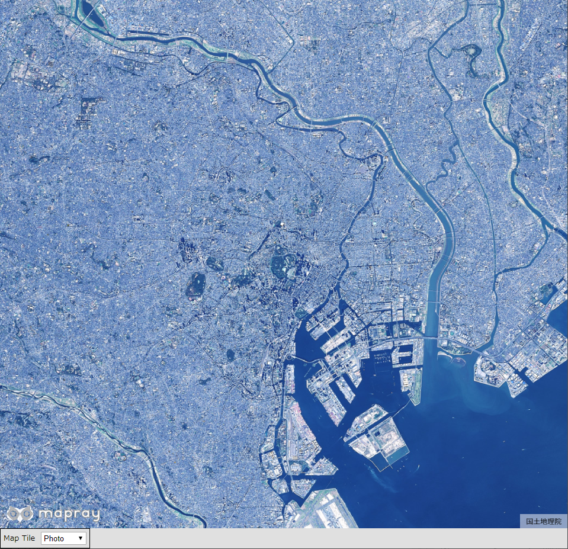
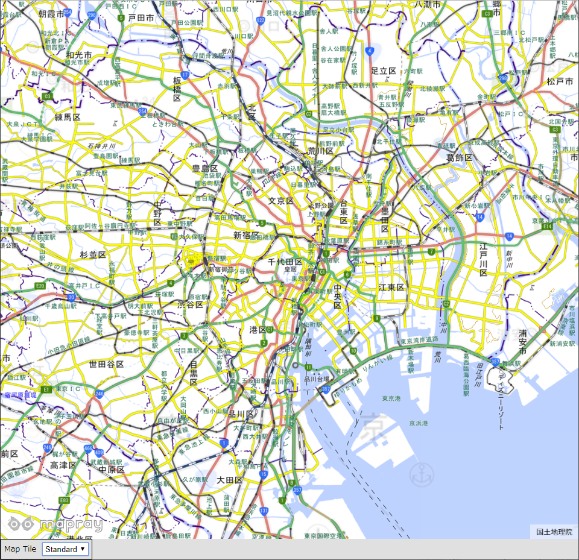

## ベース地図の変更

ベース地図を変更する方法を説明します。

### サンプルコード
ベース地図を変更する**ChangeImageTile.html**及び**ChangeImageTile.js**のサンプルコードです。
このサンプルコードでは、ベース地図を変更するコンボボックスの状態によって、ベース地図を国土地理院の標準地図と国土地理院の写真に切り替えます。

#### ChangeImageTile.html

```HTML
<!DOCTYPE html>
<html>
    <head>
        <meta charset="utf-8">
        <title>ChangeImageTileSample</title>
        <script src="https://resource.mapray.com/mapray-js/v0.7.1/mapray.js"></script>
        <link rel="stylesheet" href="https://resource.mapray.com/styles/v1/mapray.css">
        <script src="ChangeImageTile.js"></script>
        <style>
            html, body {
                height: 100%;
                margin: 0;
                background-color: #E0E0E0;
            }

            select {
                height: 22px;
                vertical-align: middle;
                font-size: 13px;
                margin-left: 10px;
            }

            p {
                font-size: 13px;
                margin-left: 5px;
            }

            div#mapray-container {
                display: flex;
                position: relative;
                height: calc(100% - 34px);
            }

            div#MapTileBox {
                display: flex;
                background-color: #E0E0E0;
                height: 32px;
                width: 150px;
                border: inset 1px #000000;
                align-items: center;
                float:left;
            }
        </style>
    </head>

    <body onload="CreateViewerImageControlInstance('mapray-container');">
        <div id="mapray-container"></div>

        <div id="MapTileBox">
            <p>Map Tile</p>
            <select name="MapTilePullDown" id="MapTilePullDown" onchange="MapTileValueChanged()">
                <option value="Photo">Photo</option>
                <option value="std">Standard</option>
            </select>
        </div>
    </body>
</html>
```

#### ChangeImageTile.js

```JavaScript
var viewer_Image_Control;

class ViewerImageControl {

    constructor(container) {
        // Access Tokenを設定
        this.accessToken = "<your access token here>";

        this.container = container;

        // Viewerを作成する
        this.viewer = new mapray.Viewer(
            this.container, {
                image_provider: this.createImageProvider(),
                dem_provider: new mapray.CloudDemProvider(this.accessToken)
            }
        );

        this.SetCamera();
    }

    // 画像プロバイダを生成
    createImageProvider() {
        //UIのマップタイルを取得
        var map_Tile_Value = document.getElementById("MapTilePullDown").value;

        if (map_Tile_Value == "std") {
            // 国土地理院提供の標準地図タイルを設定
            return new mapray.StandardImageProvider("https://cyberjapandata.gsi.go.jp/xyz/std/", ".png", 256, 5, 18);
        } else {
            // 国土地理院提供の写真タイルを設定
            return new mapray.StandardImageProvider("https://cyberjapandata.gsi.go.jp/xyz/seamlessphoto/", ".jpg", 256, 2, 18);
        }
    }

    SetCamera() {
        // カメラ位置の設定

        // 球面座標系（経度、緯度、高度）で視点を設定。座標は皇居
        var home_pos = { longitude: 139.7528, latitude: 35.685175, height: 45000 };

        // 球面座標から地心直交座標へ変換
        var home_view_geoPoint = new mapray.GeoPoint( home_pos.longitude, home_pos.latitude, home_pos.height );
        var home_view_to_gocs = home_view_geoPoint.getMlocsToGocsMatrix( mapray.GeoMath.createMatrix() );

        // 視線方向を定義
        var cam_pos = mapray.GeoMath.createVector3([0, 0, 7000]);
        var cam_end_pos = mapray.GeoMath.createVector3([0, 0, 0]);
        var cam_up = mapray.GeoMath.createVector3([0, 1, 0]);

        // ビュー変換行列を作成
        var view_to_home = mapray.GeoMath.createMatrix();
        mapray.GeoMath.lookat_matrix(cam_pos, cam_end_pos, cam_up, view_to_home);

        // カメラの位置と視線方向からカメラの姿勢を変更
        var view_to_gocs = this.viewer.camera.view_to_gocs;
        mapray.GeoMath.mul_AA(home_view_to_gocs, view_to_home, view_to_gocs);

        // カメラのnear、farの設定
        this.viewer.camera.near = 30;
        this.viewer.camera.far = 1000000;
    }

    ChangeMapTile() {
        // Viewerのインスタンスを破棄
        this.viewer.destroy();

        // Viewerを作成
        this.viewer = new mapray.Viewer(
            this.container, {
                image_provider: this.createImageProvider(),
                dem_provider: new mapray.CloudDemProvider(this.accessToken)
            }
        );

        this.SetCamera();
    }

}

function CreateViewerImageControlInstance(container) {
    viewer_Image_Control = new ViewerImageControl(container);
}

function MapTileValueChanged() {
    viewer_Image_Control.ChangeMapTile();
}
```

### htmlのサンプルコードの詳細
htmlのサンプルコードの詳細を以下で解説します。

#### htmlの文字コード設定
4行目でhtmlの文字コードを設定します。このサンプルコードでは、utf-8を設定します。

```HTML
<meta charset="utf-8">
```

#### タイトルの設定
5行目でタイトルを設定します。このサンプルコードでは、ChangeImageTileSampleを設定します。

```HTML
<title>ChangeImageTileSample</title>
```

#### JavaScriptファイルのパス設定
6～8行目で参照するJavaScript及びスタイルシートのパスを設定します。このサンプルコードでは、maprayのJavaScriptファイル、スタイルシート、ベース地図を変更するJavaScriptファイル（**ChangeImageTile.js**）を設定します。

```HTML
<script src="https://resource.mapray.com/mapray-js/v0.7.1/mapray.js"></script>
<link rel="stylesheet" href="https://resource.mapray.com/styles/v1/mapray.css">
<script src="ChangeImageTile.js"></script>
```

#### スタイルの設定
9～43行目で表示する要素のスタイルを設定します。このサンプルコードでは、下記のスタイルを設定します。
- html
- body
- select
- p
- div#mapray-container（地図表示部分）
- div#MapTileBox（ベース地図変更コンボボックス表示部分）

```HTML
<style>
    html, body {
        height: 100%;
        margin: 0;
        background-color: #E0E0E0;
    }

    select {
        height: 22px;
        vertical-align: middle;
        font-size: 13px;
        margin-left: 10px;
    }

    p {
        font-size: 13px;
        margin-left: 5px;
    }

    div#mapray-container {
        display: flex;
        position: relative;
        height: calc(100% - 34px);
    }

    div#MapTileBox {
        display: flex;
        background-color: #E0E0E0;
        height: 32px;
        width: 150px;
        border: inset 1px #000000;
        align-items: center;
        float:left;
    }
</style>
```

#### loadイベントの設定
画面を表示する時に、ベース地図変更クラスを生成します。そのため、46行目でページの読み込み時に、ベース地図変更クラスのインスタンスを生成する関数（**CreateViewerImageControlInstance**）を呼ぶように設定します。
ベース地図変更クラスのインスタンスを生成する関数は、JavaScriptのサンプルコードの詳細で説明します。

```HTML
<body onload="CreateViewerImageControlInstance('mapray-container');">
```

#### 表示する要素の記述
47～55行目で表示する要素を記述します。このサンプルコードでは、地図表示部分、ベース地図変更コンボボックス表示部分を記述します。
ベース地図変更コンボボックス表示部分のブロックには、ベース地図を変更するコンボボックスを定義します。このサンプルコードでは、photo（写真表示）、Standard（標準地図表示）を設定します。また、コンボボックスが変更された時のイベント（onchange）に、コンボボックス表示時に呼び出す関数（MapTileValueChanged）を設定します。ベース地図の変更メソッドを呼び出す関数はJavaScriptのサンプルコードの詳細で説明します。
また、地図表示部分の詳細は、ヘルプページ『**緯度経度によるカメラ位置の指定**』を参照してください。

```HTML
<div id="mapray-container"></div>

<div id="MapTileBox">
    <p>Map Tile</p>
    <select name="MapTilePullDown" id="MapTilePullDown" onchange="MapTileValueChanged()">
        <option value="Photo">Photo</option>
        <option value="std">Standard</option>
    </select>
</div>
```

### JavaScriptのサンプルコードの詳細
JavaScriptのサンプルコードの詳細を以下で解説します。

#### クラスとグローバル変数
3～79行目でベース地図を変更するクラスを定義します。クラス内の各メソッドの詳細は以降で解説します。
また、1行目でベース地図を変更するクラスのグローバル変数を定義します。

```JavaScript
var viewer_Image_Control;

class ViewerImageControl {

    //中略

}
```

#### コンストラクタ
5～20行目がベース地図を変更するクラスのコンストラクタです。
引数として渡されるブロックのidに対して、mapray.Viewerを作成し、カメラの位置・向きの設定メソッドを呼び出します。mapray.Viewerのベース地図の画像プロバイダは、画像プロバイダの作成メソッドで取得した画像プロバイダを設定します。
mapray.Viewerの作成の詳細は、ヘルプページ『**緯度経度によるカメラ位置の指定**』を参照してください。

```JavaScript
constructor(container) {
    // Access Tokenを設定
    this.accessToken = "<your access token here>";

    this.container = container;

    // Viewerを作成する
    this.viewer = new mapray.Viewer(
        this.container, {
            image_provider: this.createImageProvider(),
            dem_provider: new mapray.CloudDemProvider(this.accessToken)
        }
    );

    this.SetCamera();
}
```

#### 画像プロバイダの生成
23～34行目が画像プロバイダの作成メソッドです。ベース地図を変更するコンボボックスの値に応じて、標準地図か写真の画像プロバイダを返します。
画像プロバイダの作成の詳細は、ヘルプページ『**緯度経度によるカメラ位置の指定**』を参照してください。

```JavaScript
// 画像プロバイダを生成
createImageProvider() {
    // UIのマップタイルを取得
    var map_Tile_Value = document.getElementById("MapTilePullDown").value;

    if (map_Tile_Value == "std") {
        // 国土地理院提供の標準地図タイルを設定
        return new mapray.StandardImageProvider("https://cyberjapandata.gsi.go.jp/xyz/std/", ".png", 256, 5, 18);
    }else{
        // 国土地理院提供の写真タイルを設定
        return new mapray.StandardImageProvider("https://cyberjapandata.gsi.go.jp/xyz/seamlessphoto/", ".jpg", 256, 2, 18);
    }
}
```

#### カメラの位置・向きの設定
36～62行目がカメラの位置・向きの設定メソッドです。
カメラの位置・向きの設定は、ヘルプページ『**緯度経度によるカメラ位置の指定**』を参照してください。

```JavaScript
SetCamera() {
    // カメラ位置の設定

    // 球面座標系（経度、緯度、高度）で視点を設定。座標は皇居
    var home_view_geoPoint = new mapray.GeoPoint( home_pos.longitude, home_pos.latitude, home_pos.height );
    var home_view_to_gocs = home_view_geoPoint.getMlocsToGocsMatrix( mapray.GeoMath.createMatrix() );

    // 球面座標から地心直交座標へ変換
    var home_view_geoPoint = new mapray.GeoPoint( home_pos.longitude, home_pos.latitude, home_pos.height );
    var home_view_to_gocs = home_view_geoPoint.getMlocsToGocsMatrix( mapray.GeoMath.createMatrix() );

    // 視線方向を定義
    var cam_pos = mapray.GeoMath.createVector3([0, 0, 7000]);
    var cam_end_pos = mapray.GeoMath.createVector3([0, 0, 0]);
    var cam_up = mapray.GeoMath.createVector3([0, 1, 0]);

    // ビュー変換行列を作成
    var view_to_home = mapray.GeoMath.createMatrix();
    mapray.GeoMath.lookat_matrix(cam_pos, cam_end_pos, cam_up, view_to_home);

    // カメラの位置と視線方向からカメラの姿勢を変更
    var view_to_gocs = this.viewer.camera.view_to_gocs;
    mapray.GeoMath.mul_AA(home_view_to_gocs, view_to_home, view_to_gocs);

    // カメラのnear、farの設定
    this.viewer.camera.near = 30;
    this.viewer.camera.far = 1000000;
}
```

#### ベース地図の変更
64～77行目がベース地図の変更メソッドです。
mapray.Viewerに設定されているベース地図の画像プロバイダを変更するには、mapray.Viewerを破棄する必要があります。
そのため、65行目でメンバのviewerをdestroy関数で破棄をしてから、mapray.Viewerの作成、カメラの位置・向きの設定をします。

```JavaScript
ChangeMapTile() {
    // Viewerのインスタンスを破棄
    this.viewer.destroy();

    // Viewerを作成
    this.viewer = new mapray.Viewer(
        this.container, {
            image_provider: this.createImageProvider(),
            dem_provider: new mapray.CloudDemProvider(this.accessToken)
        }
    );

    this.SetCamera();
}
```

#### ベース地図変更クラスのインスタンス生成
81～83行目の関数は、引数として渡されるブロックのidを利用して、ベース地図変更クラスのインスタンスを生成します。

```JavaScript
function CreateViewerImageControlInstance(container) {
    viewer_Image_Control = new ViewerImageControl(container);
}
```

#### ベース地図変更時のイベント
85～87行目の関数は、ベース地図変更時に呼ばれ、ベース地図変更クラスのベース地図変更メソッドを呼び出します。

```JavaScript
function MapTileValueChanged() {
    viewer_Image_Control.ChangeMapTile();
}
```

### 出力イメージ
このサンプルコードで、ベース地図にPhotoを指定した時の出力イメージは下図のようになります。


ベース地図にStandardを指定した時の出力イメージは下図のようになります。

